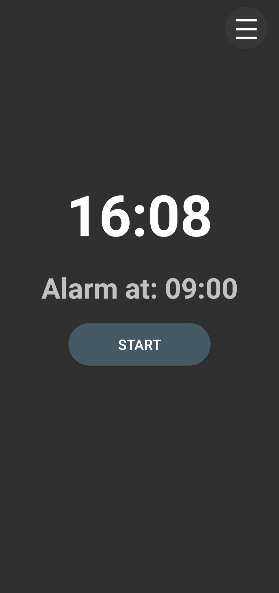
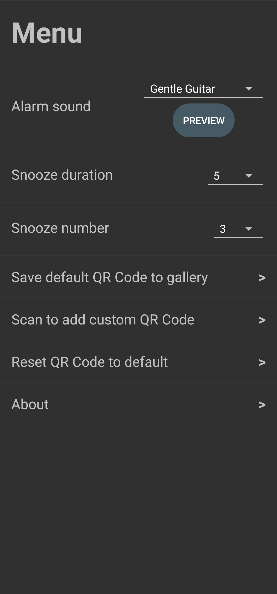
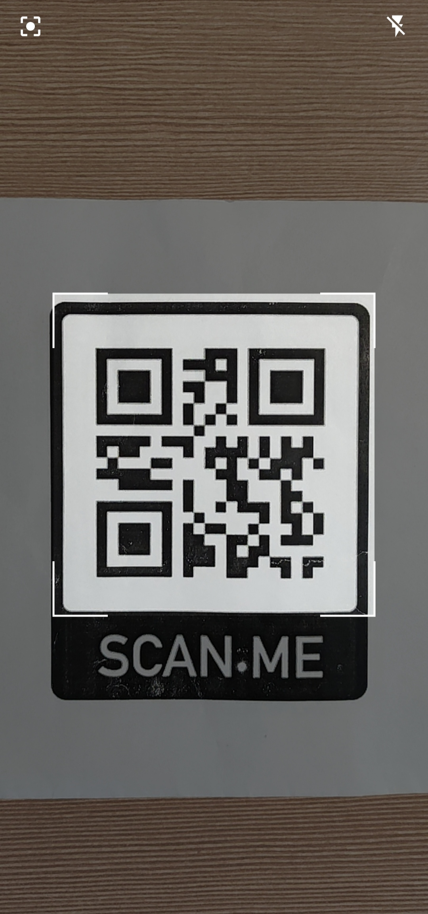

# SmartAlarm

> *SmartAlarm* is an Android alarm clock application that does not only wake You up, but also makes You get up to disable the alarm by scanning the QR Code.

# Project no longer maintained!
**Note:** The *SmartAlarm* project is no longer maintained by its owner. The new, refurbished version of *SmartAlarm* - *QRAlarm* is now available and:
-  is, as opposed to *SmartAlarm*, fully supporting all Android versions,
-  has majority of bugs present in *SmartAlarm* fixed,
-  has a fresh and aesthetic look.

In order to download it and/or contribute, please head over to the [repository page of *QRAlarm*](https://github.com/sweakpl/qralarm-android)!

## General info
No more oversleeping with *SmartAlarm*! Download the default QR code and print it, or scan Your own, put it in a place remote from Your bed, turn on the alarm and prepare for a more productive morning! SmartAlarm will make You not only wake up, but also get up to actually turn off the alarm (unless You make the alarm snooze). 

## Screenshots

	
	
	

## Setup
* Download [smart-alarm-android-signed.apk](https://github.com/sweakpl/smart-alarm-android/releases),
* Put it e.g. in a `Downloads` folder in Your Android device,
* Go to the `Downloads` folder on the Android device,
* Tap the file and install - the app doesn't require any special permissions.

## Attribution

#### Icons attribution
* Icons made by [Freepik](https://www.freepik.com) from [Flaticon](https://www.flaticon.com)

#### Sounds attribution
* "Alarm Clock" by Mike Koenig http://soundbible.com/535-Alarm-Clock.html License: Attribution 3.0
* "Air Horn" by Mike Koenig https://soundbible.com/1542-Air-Horn.html License: Attribution 3.0
* "Analog Watch Alarm" by Daniel Simion http://soundbible.com/2197-Analog-Watch-Alarm.html License: Attribution 3.0
* "Airhorn" by guitarguy1985 https://soundbible.com/1080-Airhorn.html License: Sampling Plus 1.0
* "Siren Noise" by KevanGC https://soundbible.com/1577-Siren-Noise.html License: Public Domain
* "Sunny Day" by stephan http://soundbible.com/1661-Sunny-Day.html License: Public Domain
* "Gentle Guitar" by Rasputin https://www.looperman.com/loops/detail/230868/gentle-guitar-77bpm-folk-acoustic-guitar-loop
